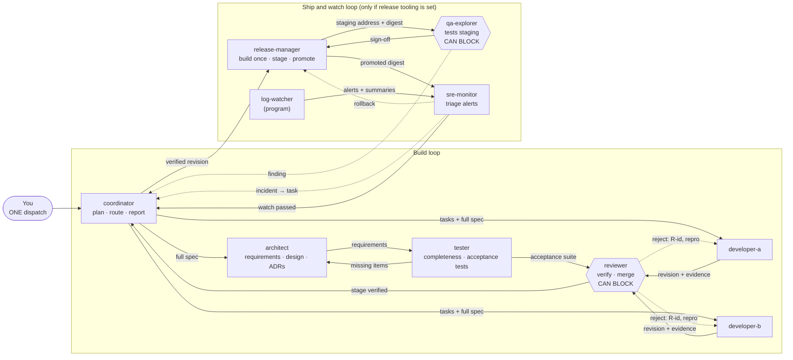
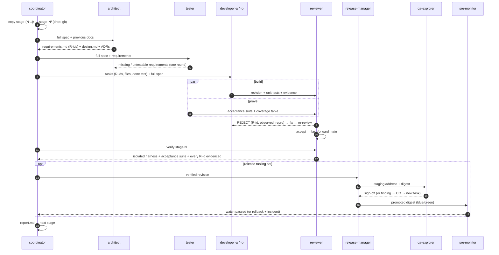
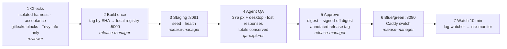
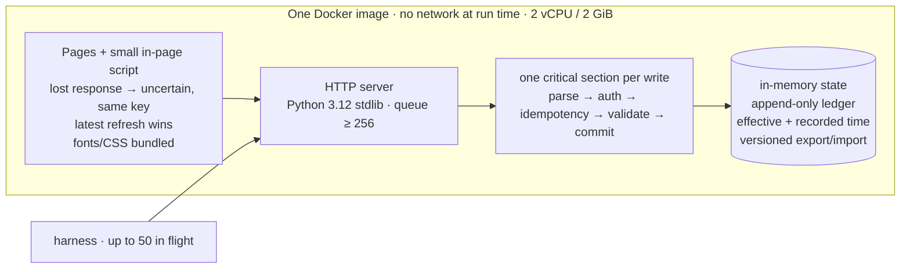
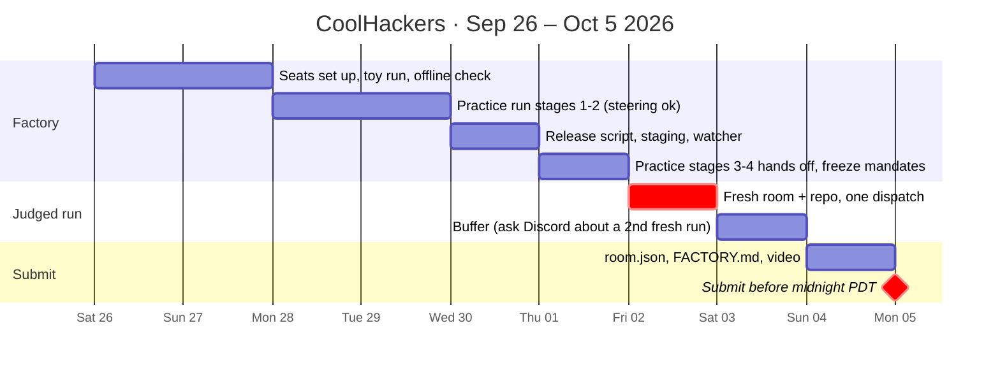
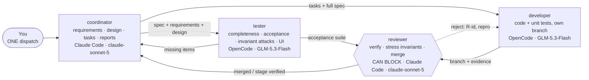

# CoolHackers · Pocketful Delivery Line · complete plan

Design: **Srilekha's "Pocketful Delivery Line"** ([docs/pocketful-delivery-line.pdf](docs/pocketful-delivery-line.pdf)),
with the changes listed in §9. Earlier tablekeeper plan: branch `tablekeeper-plan`.

> **Current design: the lean four-seat factory in [§10](#10-lean-factory-v2-after-the-toy-rehearsal).**
> §2's ten-seat design, the ship-and-watch loop, and the setup steps in §5 are kept for the
> record and are superseded where §10 differs.

Deadline: **Mon Oct 5 2026, 23:59 PDT.** Rules: `dark-factory-wearedevs/docs/participant-guide.md`
(authoritative).

---

## 1. What we submit and how it's scored

| Weight | Criterion | How this plan earns it |
|---|---|---|
| 50% | **Factory**: generic, effective, reusable | 10 role-only mandates that pass the harness scan; a requirements list plus independent acceptance tests aimed at the hidden tests; FACTORY.md with measured cost and time |
| 25% | **App** | Stage-2 UI brief in the dispatch; qa-explorer tests every flow at 375 px and desktop |
| 25% | **Agent teamwork** | Two developers plus a tester share the code; review and QA can reject; one dispatch, no steering |

**Gates. Fail one and the entry is not ranked:**
1. 3+ seats; a `mandates/<seat>.md` for **every seat that appears in `room.json`** (including log-watcher), each starting with `Harness:` and `Model:`.
2. Two seats exchange `@handle` messages in both directions.
3. `stage-1/` builds and serves from a clean container following its `RUN.md`.
4. Mandates contain no track vocabulary, and the code is written to the spec, not the tests.

## 2. The factory

### Eight roles, ten seats, one room



| Seat | Model | Owns | Rejects when |
|---|---|---|---|
| **coordinator** | claude-opus-5-5 | Routing, `tasks.md`, stage + final reports | A handoff is missing the spec, revision or evidence |
| **architect** | claude-opus-5-5 | `requirements.md` (R1..Rn), `design.md`, ADRs, invariants | A design change breaks a stated invariant |
| **tester** | claude-sonnet-5 | Completeness review; black-box acceptance suite mapped to R-ids | A requirement has no test |
| **developer-a / developer-b** | claude-sonnet-5 | Assigned tasks with unit tests, own worktree/branch | — |
| **reviewer** | claude-opus-5-5 | Clean-copy review, fast-forward merges, isolated harness, stage verification | Any check fails, an R-id lacks evidence, an invariant breaks, test-fitting |
| **qa-explorer** | claude-sonnet-5 | Exploratory testing of staging (375 px + desktop, lost/out-of-order responses) | A UI state is wrong, an effect is duplicated, an invariant breaks |
| **release-manager** | claude-sonnet-5 | The only seat that runs containers: build once, staging, blue/green, rollback | The signed-off digest ≠ the promoted digest |
| **sre-monitor** | claude-sonnet-5 | Triage of watcher alerts during the watch window | A threshold is breached → rollback and/or incident |
| **log-watcher** | none (Band SDK program) | Tails production logs, runs probes, posts to @sre-monitor | — (never decides) |

All model seats: **Harness: Claude Code**. Mandates are generated from `tools/build_mandates.py`
(one shared rule set plus a role section) and checked with `tools/scan_mandates.sh`.

### One stage, step by step



**How bad work gets caught** (for FACTORY.md):
- **Missing requirement:** the tester's completeness review, before any code.
- **Wrong behaviour:** reviewer probes and the tester's acceptance suite, both independent of the developers.
- **Integration breakage:** reviewer's clean clone + isolated harness at stage verification.
- **UI and recovery bugs:** qa-explorer on the exact image that ships.
- **Production regression:** the log-watcher's probes → sre-monitor → rollback + incident.
- **Stuck work:** the same R-id failing three times is reassigned to the other developer.
- **Test-fitting:** the reviewer rejects code that branches on test inputs.

### Release pipeline (after the reviewer accepts a stage)



Same image digest from step 2 to step 6; nothing is rebuilt after QA. **Approval gate** is OFF in the judged
run (an "approve" click would be steering); in "production mode" the release tooling waits for a human,
but no seat ever asks.

## 3. The service (technical direction lives in the dispatch, never in mandates)



| Stage | Shipped tests | What the requirements list must catch |
|---|---|---|
| 1 JSON API | 79% | Idempotency on the five write paths, resolved before validation; exact split rounding; atomic settlements; balances always sum to the seed; export/import keeps tokens, receipts, replays |
| 2 UI + holds | 35% | Lost payment response → uncertain + same-key retry; latest refresh wins; stale pay buttons; holds and partial captures; upgrade from a stage-1 export |
| 3 Statements + corrections | **9%** | Effective vs recorded time; historical overdraft checks; stable statement pagination; historical holds |
| 4 Refunds + batch corrections | 16% | Refunds from available funds; batch corrections must include every member of a settlement; strict error precedence |

Stage chain: each folder is the previous one copied forward, passes every earlier suite, and never the next.

## 4. Workspace

```
~/hackathon/
  dark-factory-wearedevs/     kickoff package (specs, harness, toy); read only
  factory/                    THIS repo: mandates/, tools/, setup-seats.sh, dispatch-*.md, docs/
  band-work/
    .claude/settings.json     pre-allowed commands for every seat (copied by setup-seats.sh)
    toy-result/               toy rehearsal repo
    practice-1/, practice-2/  pocketful practice repos (steering allowed)
    result/                   THE judged repo: fresh, used once
    checks/                   harness output directories
```

## 5. Setup

See [docs/setup-notes.md](docs/setup-notes.md). In short (lean factory v2, §10):
1. Python 3.12 venv + `pip install -r harness/requirements.txt` + Playwright; Docker running.
2. Delete any Band agents with the seat names (free tier: 10 agents; we use 4).
3. Claude login working (`claude auth status`, then a one-line `claude -p`); Featherless key in
   launchd (`launchctl setenv FEATHERLESS_API_KEY "$FEATHERLESS_API_KEY"`, macOS).
4. `DRY_RUN=1 WORKDIR=… ./setup-seats.sh`, then without `DRY_RUN` (creates the four seats).
5. New room → add all four → test one `@handle` exchange each way.

## 6. Schedule



Rule: build the release script, staging and watcher **only after a practice run reaches stage 2 in
isolated mode**. If time runs short, dispatch with `Release tooling: none`; the ship loop is not scored.

## 7. Work for the humans

| Owner | Work |
|---|---|
| Host machine | Run setup, practice runs and the judged run; nobody posts in the judged room |
| Mandate tuning | Read practice room logs; turn every stall or human question into a generic mandate fix; `tools/build_mandates.py` + `tools/scan_mandates.sh` |
| Release tooling | `release/` script: local registry :5000, staging :8081, Caddy blue/green :8080, rollback; log-watcher Band SDK program with the probes in the dispatch |
| Docs + video | README.md, FACTORY.md (measured cost via `band usage`, time per stage, real rejections from room.json), slides, video |

## 8. Submission checklist

- [ ] `mandates/` = this repo's `mandates/` (one per seat in room.json, Harness/Model filled in)
- [ ] `room.json`: Band console → room → ⋮ → Download → **Download full session**; read it for secrets
- [ ] `README.md`, `FACTORY.md` written by us (seats, setup, rationale, what failed, measured cost/time, how bad work was caught)
- [ ] Only completed stage folders; no `.git` inside any
- [ ] Fresh clone → `harness check --track pocketful` passes; `harness run --all --mode isolated`
- [ ] Follow each RUN.md by hand; use the UI
- [ ] Push history unchanged; public repo; lablab form with video (room recording required) and slides

**Video (3–5 min):** the factory diagram → the Band room (dispatch, a handoff, a reviewer or QA
rejection and the fix) → the app on desktop and phone width → isolated harness result, cost and time →
the mandates pointed at a different problem.

## 9. Changes from the original deck, and why

| Change | Why |
|---|---|
| **developer → developer-a + developer-b** | Judges read whether the work was distributed; one seat writing all the code "looks the same however many messages it sent" |
| **log-watcher gets a mandate file** (`Harness: Band SDK program`, `Model: none`) | It posts in the room, so gate 1 requires a mandate named after it |
| **Architect writes a numbered requirements list; tester maps tests to R-ids** | "A spec rule has no test" needs a list of rules; 9%/16% of stage 3/4 tests are shipped |
| **Tester does a completeness review first** | Catches missing requirements before code (spec-driven "clarify") |
| **UI: in-page script for pay/refresh/request/split** | A plain form post can't show `uncertain` and retry with the same key after a lost response |
| **Ship loop runs after a stage is verified, never overlapping the next; bounded 10-min watch; watcher stops at the final report** | The unattended run must finish; findings become tasks in the current stage, never edits to an accepted one |
| **gitleaks blocks, Trivy is informational** | Base-image CVEs would otherwise block every stage |
| **Judged run Oct 2, not Oct 3–4** | Leaves a day if it fails |
| **Pre-allowed commands, `git push` denied** | No stalls on prompts; humans push, so no credentials reach room.json |
## 10. Lean factory v2 (after the toy rehearsal)

### What the rehearsal showed

Toy rehearsal on Sep 28: three OpenCode seats (coordinator, developer-a, reviewer) on
Featherless `zai-org/GLM-5.2`, one dispatch, 61 minutes. Stage 1 was verified (harness 8/8,
reviewer accepted, 22 independent probes, 200 concurrent requests); stage 2 produced
requirements and tasks but no code. Cost: **$12.40 for 410 billed requests** (186 turns,
311 tool calls). Findings from the Band activity log:

| # | Finding | Evidence | Fix |
|---|---|---|---|
| 1 | Seats read the supplied test files | coordinator read all four toy stages' tests; developer-a read the stage-1 test before coding | Test folders and harness source unreadable in both permission files; rule in every mandate and dispatch |
| 2 | Coordinator gave up after 2 minutes and wrote the code | handoff 23:06, developer-a started 23:06; "status check" 23:08 and 23:09; coordinator wrote the service from 23:11 | One acknowledgement per handoff; wait ≥ 15 min, then one identical resend; never do another seat's work |
| 3 | Replies not delivered | reviewer: "my ACP replies don't seem to be landing" | Only send-tool messages are delivered; plain reply text is never seen |
| 4 | Stale instructions | developer-a kept on stage 1 while the stage-2 handoff had been sent twice; 13 min of stage 2 with no code | Every handoff names stage and task id and supersedes earlier ones |
| 5 | Coordinator merged and flip-flopped | "adopt", "restore", "restore" commits 23:32–23:41 | Coordinator never writes code or tests and never merges; reviewer is the only merger |
| 6 | Condensed resends | third stage-2 handoff was "condensed" | Resends are identical and complete |
| 7 | Chatter costs turns | "Thank you", "Acknowledged", "STOP"; reviewer 77 turns vs 67 tool calls | No thanks/acknowledge-only messages beyond the one acknowledgement |
| 8 | Two task lists | developer-a created 9 tasks of its own | Only the coordinator creates tasks |

### The four seats



| Seat | Harness · model | Owns | Rejects when |
|---|---|---|---|
| **coordinator** | Claude Code · `claude-sonnet-5` | requirements (R-ids), design, ADRs, invariants, tasks, reports | a handoff lacks the spec, revision or evidence; a change breaks an invariant |
| **tester** | OpenCode · `featherless/zai-org/GLM-5.3-Flash` | completeness review; acceptance suite mapped to R-ids; invariant attacks; UI checks at phone and desktop width | a requirement has no test |
| **developer** | OpenCode · `featherless/zai-org/GLM-5.3-Flash` | tasks with unit tests, own worktree and branch | — |
| **reviewer** | Claude Code · `claude-sonnet-5` | clean-copy review, fast-forward merges, isolated harness, invariant stress run, `verification.md` | a check fails, an R-id lacks evidence, an invariant breaks, test-fitting |

### What changed from §2, and why

| Change | Why |
|---|---|
| **10 seats → 4** | Judges don't score seat count. Every seat adds full-spec handoffs, messages and wake-ups; the rehearsal's cost and failures came from coordination, not capacity |
| **architect → coordinator** | In the rehearsal the coordinator wrote good requirements (R1–R30) and the completeness review caught the gap (R30); a separate architect adds a handoff chain per stage |
| **developer-a + developer-b → developer** | A second developer doubles handoffs, merges and resend risk. Distributed work is shown by four seats with distinct committed work (requirements and reports, tests, code, verification and merges) and by real review rejections |
| **qa-explorer → tester** | The tester already drives the service; interface checks at phone and desktop width join its suite |
| **Ship-and-watch loop cut** (release-manager, sre-monitor, log-watcher, staging, blue/green) | Not in the specs or the rubric; the specs only require a Dockerfile, RUN.md, health and no 5xx. Kept as a documented extension for FACTORY.md and the video |
| **Money invariants move into verification** | They were only in the watcher's probes; now the tester attacks them and the reviewer stress-tests them each stage (see the dispatch) |
| **Export includes idempotency records and tokens** | Otherwise a retry after an upgrade moves money twice |
| **Models: Claude Sonnet for coordinator + reviewer, GLM-5.3-Flash for tester + developer** | Coordinator and reviewer used ~75% of the rehearsal's turns; on a Claude subscription they cost no per-token spend. GLM-5.3-Flash is about 9× cheaper than GLM-5.2 ($0.15 / $0.50 vs $1.40 / $4.40 per million input / output tokens) |

### Context economy (why each step got cheaper)

Every seat keeps one conversation per room for the whole run, and every step re-sends all of
it; in the rehearsal that averaged about $0.03 per request. File reads and command output,
not messages, grow it fastest. So:

| Lever | Where |
|---|---|
| Handoffs paste the complete task and the **current** stage's source text (as the rules require); committed working documents go by path + commit | shared mandate rules |
| One stage handoff per seat covering all its tasks; follow-ups carry only what is new | coordinator mandate, shared rules |
| Read logs and files selectively; never re-read an unchanged file; keep reports short | shared mandate rules ("Context economy") |
| Tool output capped at 300 lines / 16 KB per call (the rest saved to disk); old tool outputs pruned; compaction starts about halfway through the 262K context (`reserved: 131072`) | `opencode-seats.json` (OpenCode seats) |

Band's own `--runtime-compact-at` is not supported by either runtime, so compaction is set in
OpenCode's config. Claude Code compacts on its own near its limit, and those two seats run on
a flat subscription. Whether `reserved` triggers compaction early as intended is checked in
the confirmation run.

### Budget rule

Before the judged run, a stage-1-only toy confirmation run on the four seats must show the
fixes hold (messages delivered, no takeovers, no test reads) and measure the Featherless
cost of one stage. Size the Featherless top-up from that number, with headroom for
Pocketful's specs being about 10× longer than the toy's.
