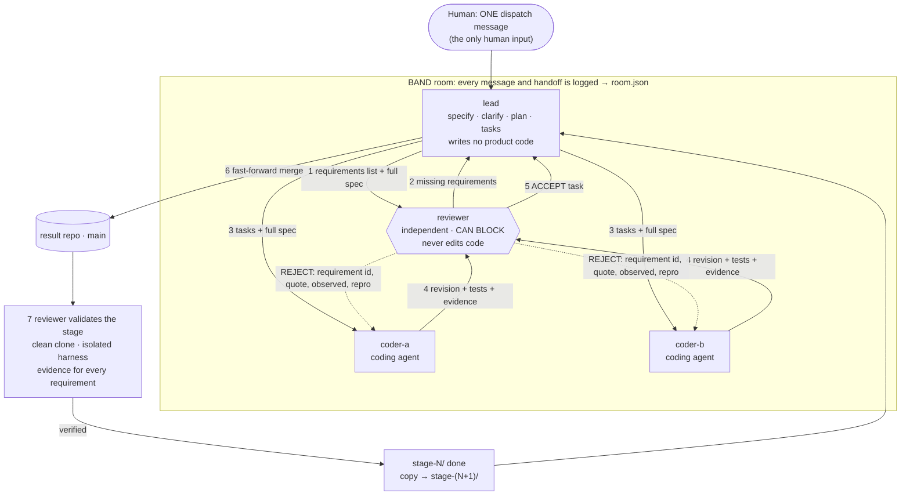
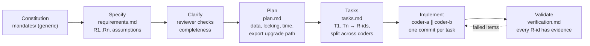
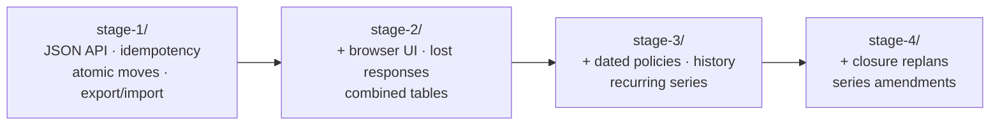
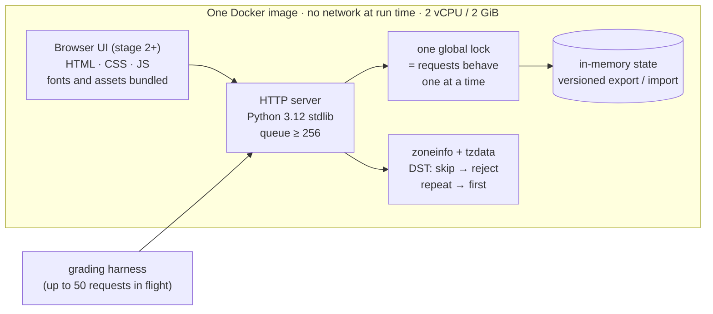
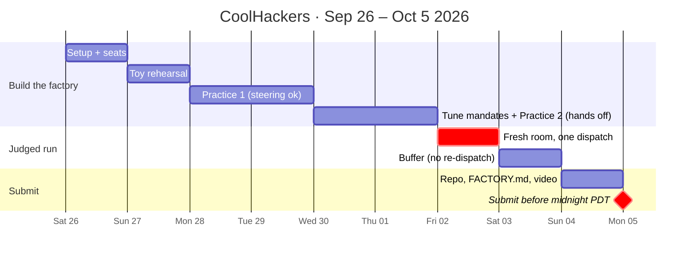

# CoolHackers · Dark Factory · tablekeeper: complete plan

Deadline: **Mon Oct 5 2026, 23:59 PDT.** Rules: `dark-factory-wearedevs/docs/participant-guide.md`
(authoritative). This plan follows spec-driven development (Spec Kit's phases:
constitution → specify → clarify → plan → tasks → implement → validate), run by agents.

---

## 1. What we submit and how it's scored

| Weight | Criterion | How this plan earns it |
|---|---|---|
| 50% | **Factory**: generic, effective, reusable | Spec-driven mandates with no track words; a requirements list that targets the hidden tests; FACTORY.md with measured cost and time |
| 25% | **App** | Stage-2 UI brief in the dispatch task; the reviewer checks it at 375 px and desktop |
| 25% | **Agent teamwork** | Two coders share the work; every task gets a real review; commits authored per seat; one dispatch, no steering |

**Gates. Fail one and the entry is not ranked:**
1. 3+ seats, each with `mandates/<seat>.md` starting with `Harness:` and `Model:`.
2. `room.json` shows two seats exchanging `@handle` messages in both directions.
3. `stage-1/` builds and serves from a clean container following its `RUN.md`.
4. Mandates contain no track vocabulary, and the code is written to the spec, not the tests.

## 2. Workspace layout

```
~/hackathon/
  dark-factory-wearedevs/     kickoff package (specs, harness, toy). Never submitted.
  factory/                    OUR factory inputs (source of truth; copied into the repo at the end)
    mandates/                 lead.md  coder-a.md  coder-b.md  reviewer.md
    dispatch-tablekeeper.md   the one task message for the judged run
    PLAN.md                   this file
  band-work/
    toy-result/               practice repo for the toy track
    practice-1/, practice-2/  tablekeeper practice repos (steering allowed)
    result/                   THE judged repo: fresh, used once
    checks/                   harness output directories
```

## 3. The factory

### Seats

| Seat | Role | Writes | Harness / model (fill in) |
|---|---|---|---|
| `lead` | Specify, clarify, plan, tasks, fast-forward merges, stage reports | `specs/stage-N/requirements.md, plan.md, tasks.md` | Claude Code / strongest model you can use |
| `coder-a` | Coding agent: implements assigned tasks with its own tests | product code + tests on branch `coder-a` | Claude Code or OpenCode+Featherless |
| `coder-b` | Coding agent: same, in parallel | product code + tests on branch `coder-b` | same or a different model |
| `reviewer` | Requirements review, task review, stage verification; **can block** | `specs/stage-N/verification.md`, `probes/` | Claude Code / strong model (a different model from the coders is a plus) |

### Who talks to whom



### Spec-driven steps inside one stage



### Stage chain (each folder must pass its own stage and all earlier ones, and not the next)



### Detailed sequence

```
dispatch (the only human input)
  │
  ▼
lead ── carry forward stage-(N-1)/ → stage-N/ (remove .git)
  │     SPECIFY   requirements.md: every "must", table row, error, limit → R1..Rn + assumptions A1..
  │     CLARIFY   → @reviewer completeness review (one round) → add what's missing
  │     PLAN      plan.md: data model, lock strategy, time handling, export version + upgrade path
  │     TASKS     tasks.md: T1..Tn, owner, R-ids, files, done test; balanced across coders
  ▼
@coder-a  ║  @coder-b         IMPLEMENT in own worktree/branch, tests derived from R-ids,
          ║                   one commit per task "T3: … (R12, R14)", authored as the seat
  ▼
@reviewer TASK REVIEW  fresh checkout, own probes → accept | reject(R-id, quote, observed, repro)
  │          reject ──► coder fixes, adds the test that would have caught it ──► re-review
  ▼ accept
lead  fast-forward main (never resolves conflicts; sends back to coder to merge main)
  ▼ all tasks on main
@reviewer VALIDATE  fresh clone, no-cache build, isolated harness run:
                    claims stage N · earlier stages pass · next stage fails
                    every R-id has evidence in verification.md · hygiene · no test-fitting
  ▼ verified
lead  stage report → post the verified revision → next stage
```

**How bad work gets caught and fixed** (for FACTORY.md):
- A missing requirement is caught at the clarify step, before any code.
- Wrong behaviour is caught at task review by the reviewer's own probes, not the coders' tests.
- Integration breakage is caught at validation from a clean, isolated build.
- A seat stuck on the same requirement three times: the lead reassigns it to the other coder.
- Test-fitting: the reviewer rejects code that branches on test inputs or has no R-id behind it.

### Why each choice (for FACTORY.md's rationale)

- **A requirements list:** the shipped checks cover only 83/41/11/21% of stages 1–4. The hidden tests all come from the spec text, so we turn the text itself into the checklist.
- **Two coders:** judges read whether the work was distributed. One coder doing 90% "looks the same however many messages it sent".
- **Reviewer can't edit code:** keeps its verdict independent, and makes every fix visible as a coder commit traced to a room message.
- **Fast-forward-only merges by the lead:** two coders share one repo without either overwriting the other, and history is never rewritten.
- **Self-contained handoffs:** Band seats only see messages addressed to them.

## 4. Technical direction (lives in the dispatch task, never in mandates)



- Python 3.12 standard library, one process. All state in memory behind one global lock, which makes requests behave as if run one at a time, as the spec requires, and makes export an atomic snapshot. Server queue ≥ 256 for 50 simultaneous requests.
- `tzdata` installed during the image build, then `zoneinfo`: skipped hour → reject; repeated hour → first occurrence; durations in real minutes.
- Export carries a version; every stage imports all earlier stages' exports.
- Stage 2 UI: static HTML/CSS/JS from the same process, assets bundled, warm hospitality look, 375 px to desktop.

| Stage | Shipped tests | What the requirements list must catch |
|---|---|---|
| 1 | 83% | Idempotency resolved before validation; key scoped per user; error precedence; DST; atomic moves (1–8 items); export/import keeps tokens, receipts, replays |
| 2 | 41% | Late search responses ignored; lost response → retry with the same key; 409 keeps the form; combined pairs (not transitive); upgrade from stage-1 export; UI states |
| 3 | **11%** | Explain output (both rules, every table); history numbering and no-op rules; policy selection by local date; revision and accepted terms; recurring series; moves under policies |
| 4 | 21% | Replan: brute force over ≤6 bookings with a 3-level tie-break, preview stores only the plan, stale plan, apply is atomic; series amend; revision counters |

## 5. Setup (do once, today)

```sh
# kickoff package + harness
cd ~/hackathon/dark-factory-wearedevs
python3.12 -m venv .venv && . .venv/bin/activate      # any Python 3.12+
python -m pip install -r harness/requirements.txt
python -m playwright install chromium
python -m harness --help
docker --version                                      # the Docker daemon must be running

# practice repo for the toy
mkdir -p ../band-work/toy-result/stage-1 ../band-work/toy-result/mandates ../band-work/checks
cp scaffold/* ../band-work/toy-result/stage-1/
git -C ../band-work/toy-result init -b main
```

**Band Desktop seats.** Create 4 seats named exactly `lead`, `coder-a`, `coder-b`, `reviewer`. The mandate file names must match the seat names as the room shows them. Paste each seat's mandate as its standing instructions. Then confirm each can `@`-message another and get a reply. Run `/jam as <role> with <handle>` in each Claude Code session, or create them with **New local agent** in Band Desktop.

**Secrets:** Featherless key only in `~/.zshrc` or `~/.config/opencode/opencode.json`, never in a repo, since `room.json` isn't redacted.

## 6. Schedule



| When | Goal | Done when |
|---|---|---|
| **Sat Sep 26** | Setup (§5). Fill in `Harness:` and `Model:` in each mandate. | `harness --help` works; 4 seats reply to `@` messages |
| **Sun Sep 27** | **Toy rehearsal**, all 4 stages, with our mandates. Download `room.json`; `harness check` on the toy repo. | Gates 1, 2 and 4 pass on the toy; first cost and time numbers |
| **Mon–Tue Sep 28–29** | **Practice 1** on tablekeeper (`band-work/practice-1`). Steering allowed. Note every time we had to step in. | Stage 1 claims 1 in isolated mode |
| **Wed–Thu Sep 30–Oct 1** | Fix the mandates for each step-in (generically!). **Practice 2** without touching, as far as it gets. Re-run the banned-word scan. | A hands-off run reaches stage 2+ |
| **Fri Oct 2** | **Judged run**: fresh room + fresh `band-work/result`, paste `dispatch-tablekeeper.md` once, then hands off. Only watch. | Lead's final report |
| **Sat Oct 3** | Buffer if the run is still going. Never re-dispatch; a rerun is disqualified steering. | — |
| **Sun Oct 4** | Assemble the submission (§7), record the video. | Clean-clone checks pass |
| **Mon Oct 5** | Submit on lablab before 23:59 PDT. Keep the receipt. | Submitted |

**Budget check after the toy run:** multiply the toy's requests and cost by roughly 20–40 for the full tablekeeper run. If the $25 of Featherless credits can't cover it, move the lead and reviewer to a Claude subscription seat and keep the coders on Featherless.

## 7. Submission checklist

The humans write only README.md, FACTORY.md, mandates/ and room.json. The band writes `stage-N/` and `specs/`.

- [ ] `mandates/` copied from `factory/mandates/`, with `Harness:` and `Model:` filled in with exact model ids
- [ ] `room.json`: Band console → room → ⋮ → Download → **Download full session** → rename. Read it for secrets.
- [ ] `README.md`: team, track, how to read the repo, stages reached
- [ ] `FACTORY.md`:
  - seat setup, step by step
  - the flow diagram
  - rationale (§3)
  - what we tried that failed (from the practice runs)
  - **measured** time per stage and model spend per seat
  - how bad work is caught, with 2–3 real rejections from `room.json` and the commits that fixed them
- [ ] Only completed stage folders; no `.git` inside any stage folder
- [ ] Fresh clone → `python -m harness check <clone> --track tablekeeper` passes
- [ ] Fresh clone → `python -m harness run --track tablekeeper --repo <clone> --all --mode isolated`: count from stage 1 until the first folder that doesn't claim its stage
- [ ] Follow each `RUN.md` by hand and use the UI
- [ ] Push history unchanged (no squash or rebase); public GitHub repo, cloneable without Band
- [ ] lablab form: title, short and long description, tags, cover image, slides, **video**, repo URL

**Video (3–5 min):**
1. 30 s: the problem, and the factory diagram
2. 90 s: **the Band Desktop room recording**, showing the dispatch, a lead → coder handoff, a reviewer **rejection** and the fix coming back. This part is required.
3. 60 s: the app (search grid, booking, a double-book attempt refused, lookup and cancel) on desktop and phone width
4. 30 s: the isolated harness result and cost/time numbers
5. 15 s: the mandates are generic (point them at the toy or a different problem)

## 8. Risks

| Risk | Mitigation |
|---|---|
| A seat asks the human a question during the judged run | Every mandate forbids it; practice 2 is a hands-off rehearsal |
| Track words slip into a mandate while tuning | Re-run the vocabulary scan after every mandate edit (command below) |
| Coders fit the code to the shipped tests | Coders test from R-ids; reviewer rejects test-fitting; dispatch forbids reading test sources |
| Budget runs out mid-run | Measure on the toy; stronger model only for lead and reviewer |
| Stage folder passes the next stage's tests (overshoot) | Dispatch forbids later features; reviewer checks that the next suite fails |
| A nested `.git` makes a stage folder arrive empty for judges | Lead deletes it at carry-forward; reviewer checks hygiene; clean-clone check |
| Seats can't connect to BAND (plugin or relay errors) | Run the seats on one dedicated personal machine with personal model accounts; ask in the BAND Discord early |

Vocabulary scan (run from `~/hackathon/dark-factory-wearedevs`):

```sh
python3 -c "
import pathlib,sys; sys.path.insert(0,'.')
from harness.vocabulary import terms_in, for_track
b=set(for_track('tablekeeper'))|set(for_track('pocketful'))
for f in pathlib.Path('../factory/mandates').glob('*.md'):
  for n,l in enumerate(f.read_text().splitlines(),1):
    h=[t for k,t in terms_in(l) if t in b]
    h and print(f.name,n,h)
print('scan done')"
```